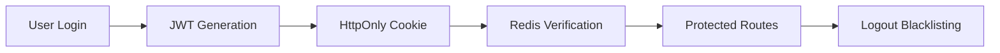
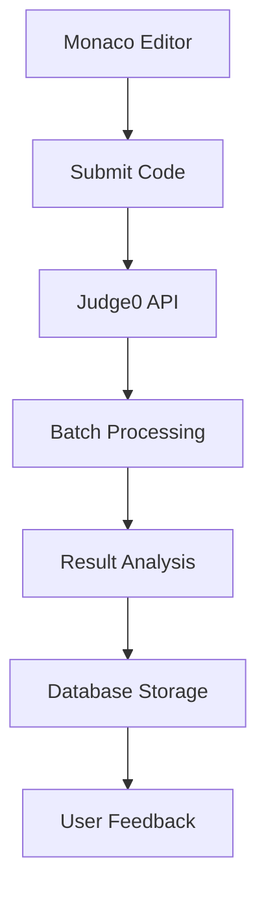

<div align="center">

# 🚀 SEGFAULT
### *The Ultimate AI-Powered Coding Practice Platform*

<p align="center">
  <strong>Master Data Structures & Algorithms with AI-powered tutoring, real-time code execution, and expert video solutions</strong>
</p>

<p align="center">
  <a href="https://segfault-frontend-1.netlify.app" target="_blank">
    
  </a>
  <a href="#" target="_blank">
    
  </a>
  <a href="#" target="_blank">
    
  </a>
</p>

<p align="center">
  
  
  
  
  
</p>

---

</div>

## 📋 Table of Contents
- [🎯 About The Project](#-about-the-project)
- [✨ Core Features](#-core-features)
- [🏗️ Architecture](#️-architecture)
- [🛠️ Tech Stack](#️-tech-stack)
- [🚀 Getting Started](#-getting-started)
- [📡 API Reference](#-api-reference)
- [🤝 Contributing](#-contributing)
- [📄 License](#-license)

---

## 🎯 About The Project

**SEGFAULT** bridges the gap between learning and mastering Data Structures & Algorithms. Unlike traditional platforms that leave you stuck, SEGFAULT integrates:

🤖 **AI-Powered Tutoring** - Get contextual hints and code reviews from Google Gemini  
⚡ **Real-Time Execution** - Test your code instantly with visible test cases  
🎯 **Comprehensive Judging** - Submit solutions against hidden test cases  
📚 **Video Editorials** - Learn from expert explanations  
🔒 **Secure Platform** - Enterprise-grade authentication with Redis caching

> *Perfect for technical interview prep or sharpening your competitive programming skills*

---

## ✨ Core Features

<table>
<tr>
<td width="50%" valign="top">

### 🧑‍💻 **For Developers**
- **🎨 Monaco Editor Integration** - Code in C++, Java, or JavaScript
- **⚡ Instant Code Execution** - Run against visible test cases
- **🎯 Smart Submission System** - Comprehensive hidden test evaluation
- **🤖 AI-Powered Tutor** - Google Gemini for hints & code reviews
- **📊 Progress Tracking** - Detailed submission history
- **🔍 Smart Problem Discovery** - Filter by difficulty, tags, status
- **🎥 Video Solutions** - High-quality explanations

</td>
<td width="50%" valign="top">

### 👨‍💼 **For Administrators**
- **📝 Complete Problem Management** - Full CRUD operations
- **🔐 Secure Admin Dashboard** - Role-based access control
- **☁️ Seamless Video Uploads** - Cloudinary-powered with progress tracking
- **🛡️ Protected Endpoints** - Secure content management
- **📊 Centralized Control** - Single interface for all content

</td>
</tr>
</table>

---

## 🏗️ Architecture

### 🔐 **Authentication Flow**


### ⚡ **Code Execution Pipeline**


### 🤖 **AI Tutor Integration**
The AI system maintains context awareness by sending:
- Problem description & constraints
- User's current code
- Previous conversation history
- Specific question context

---

## 🛠️ Tech Stack

<div align="center">

| **Category** | **Technology** |
|:---:|:---:|
| **Frontend** | React.js • Redux Toolkit • Vite • Tailwind CSS • Monaco Editor |
| **Backend** | Node.js • Express.js • JWT Authentication |
| **Database** | MongoDB • Mongoose ODM |
| **Caching** | Redis (Session Management) |
| **Services** | Judge0 API • Google Gemini • Cloudinary |
| **Deployment** | Netlify • Cloud Hosting |

</div>

---

## 🚀 Getting Started

### Prerequisites
```bash
Node.js v18.x+
MongoDB (local/cloud)
Redis instance
```

### 🖥️ Backend Setup
```bash
# Clone and navigate
git clone https://github.com/your-username/segfault-repo.git
cd segfault-repo/backend

# Install dependencies
npm install

# Configure environment
cp .env.example .env
# Edit .env with your credentials

# Start server
npm start
```

### 🎨 Frontend Setup
```bash
# Navigate to frontend
cd ../frontend

# Install and run
npm install
npm run dev
```

### 🔧 Environment Variables
```env
PORT=3000
DB_CONNECT_STRING=mongodb://your-mongodb-url
REDIS_PASS=your-redis-password
JWT_KEY=your-super-secret-jwt-key
JUDGE0_KEY=your-rapidapi-judge0-key
GEMINI_KEY=your-google-gemini-api-key
CLOUDINARY_CLOUD_NAME=your-cloudinary-cloud
CLOUDINARY_API_KEY=your-cloudinary-key
CLOUDINARY_API_SECRET=your-cloudinary-secret
```

---

## 📡 API Reference

<details>
<summary><strong>🔓 Authentication Endpoints</strong></summary>

| Method | Endpoint | Description | Auth Required |
|:---:|:---|:---|:---:|
| `POST` | `/user/register` | Register new user | ❌ |
| `POST` | `/user/login` | User login | ❌ |
| `POST` | `/user/logout` | Logout & blacklist token | ✅ |
| `GET` | `/user/check` | Check auth status | ✅ |

</details>

<details>
<summary><strong>🧩 Problem Management</strong></summary>

| Method | Endpoint | Description | Role |
|:---:|:---|:---|:---:|
| `POST` | `/problem/create` | Create new problem | Admin |
| `PUT` | `/problem/update/:id` | Update problem | Admin |
| `DELETE` | `/problem/delete/:id` | Delete problem | Admin |
| `GET` | `/problem/problemById/:id` | Get single problem | User |
| `GET` | `/problem/getAllProblem` | List all problems | User |

</details>

<details>
<summary><strong>⚡ Code Execution</strong></summary>

| Method | Endpoint | Description | Auth Required |
|:---:|:---|:---|:---:|
| `POST` | `/submission/run/:id` | Test against visible cases | ✅ |
| `POST` | `/submission/submit/:id` | Submit for judging | ✅ |
| `GET` | `/problem/submittedProblem/:pid` | Get submission history | ✅ |

</details>

<details>
<summary><strong>🤖 AI & Media</strong></summary>

| Method | Endpoint | Description | Role |
|:---:|:---|:---|:---:|
| `POST` | `/ai/chat` | Chat with AI tutor | User |
| `GET` | `/video/create/:problemId` | Get upload signature | Admin |
| `POST` | `/video/save` | Save video metadata | Admin |

</details>

---

## 🎯 Key Features Deep Dive

### 🤖 **AI-Powered Learning**
The Gemini-powered tutor provides:
- **Contextual Hints** - Understands your current problem
- **Code Review** - Analyzes your solution approach  
- **Complexity Analysis** - Explains time/space complexity
- **Debugging Help** - Identifies logical errors

### ⚡ **Real-Time Code Execution**
- **Instant Feedback** - See results immediately
- **Multiple Languages** - C++, Java, JavaScript support
- **Performance Metrics** - Runtime and memory usage
- **Test Case Management** - Visible for testing, hidden for judging

### 🔒 **Enterprise Security**
- **JWT Authentication** - Secure token-based auth
- **Redis Blacklisting** - Instant logout security
- **Role-Based Access** - Admin/User permission system
- **bcrypt Hashing** - Secure password storage

---

## 🤝 Contributing

We love contributions! Here's how to get started:

1. **🍴 Fork** the repository
2. **🔀 Create** your feature branch (`git checkout -b feature/AmazingFeature`)
3. **💻 Commit** your changes (`git commit -m 'Add AmazingFeature'`)
4. **📤 Push** to the branch (`git push origin feature/AmazingFeature`)
5. **🔄 Open** a Pull Request

### 🐛 Found a Bug?
Please check our [Issues](https://github.com/shiva-91/segfault-repo/issues) page and create a new issue if it hasn't been reported.

---

## 📄 License

This project is licensed under the **MIT License** - see the [LICENSE](LICENSE) file for details.

---

<div align="center">

### 🌟 **Star this repo if you found it helpful!** 🌟

**Built with ❤️ by developers, for developers**

[⬆ Back to Top](#-segfault)

</div>
